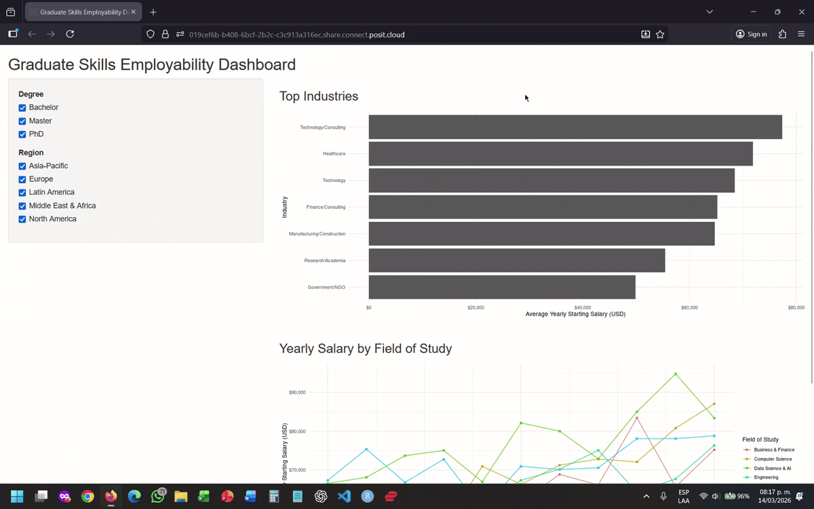

# 532IndivAssignmentHectorPalafox (Graduate Skills Employability Dashboard)
## 532 - Individual Assignment (Héctor Palafox Prieto)

This project provides an interactive Shiny dashboard built in `R` for exploring graduate employability outcomes across degree levels, regions, industries, fields of study, and graduation years.

The dashboard is based on the project of the same name available [here](https://github.com/UBC-MDS/DSCI-532_2026_12_GradSkills/).

## For Users

### Who should use this dashboard?

This dashboard is designed for prospective students, recent graduates, career advisors, and academic staff who want to explore graduate employment trends in an interactive way. It helps users compare outcomes across different degree levels and regions, and makes it easier to understand how starting salaries vary by industry, field of study, and graduation year.

### What can you explore?

The app currently includes:

- **Degree-level filtering** to focus on specific graduate groups
- **Region filtering** to compare outcomes across locations
- A **Top Industries** bar chart showing the industries with the highest average starting salaries
- A **Yearly Salary by Field of Study** line chart showing how average starting salary changes over time across fields of study

### Try it yourself

Stable app: [https://019cef6b-b408-6bcf-2b2c-c3c913a316ec.share.connect.posit.cloud/](https://019cef6b-b408-6bcf-2b2c-c3c913a316ec.share.connect.posit.cloud/)

### Demo



## For contributors

### Run locally

#### 1) Clone the repository

```bash
git clone https://github.com/hpalafoxp/532IndivAssignmentHectorPalafox.git
cd 532IndivAssignmentHectorPalafox
```

#### 2) Open the project in RStudio

Open the `.Rproj` file to work from the project root.

#### 3) Install required packages

From an R session, install the required packages:

```r
install.packages(c("shiny", "ggplot2", "dplyr", "scales"))
```

#### 4) Run the dashboard

Because the app is located at the root of the repository, run:

```r
shiny::runApp()
```

Shiny will launch a local version of the dashboard in your browser.
